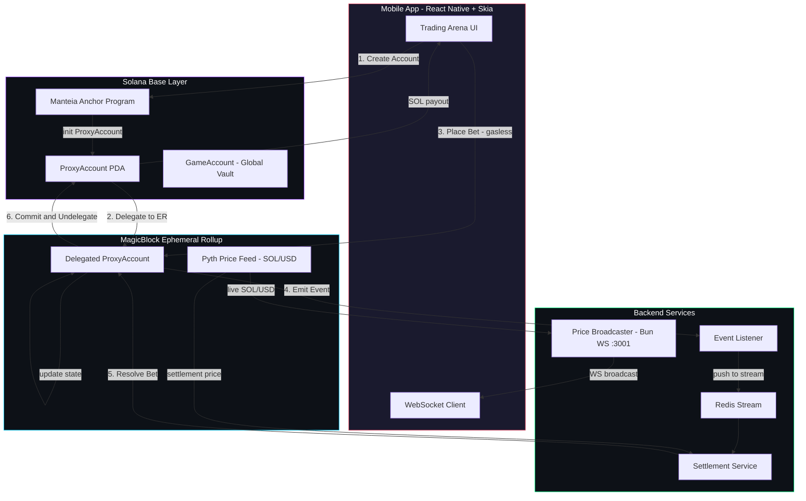
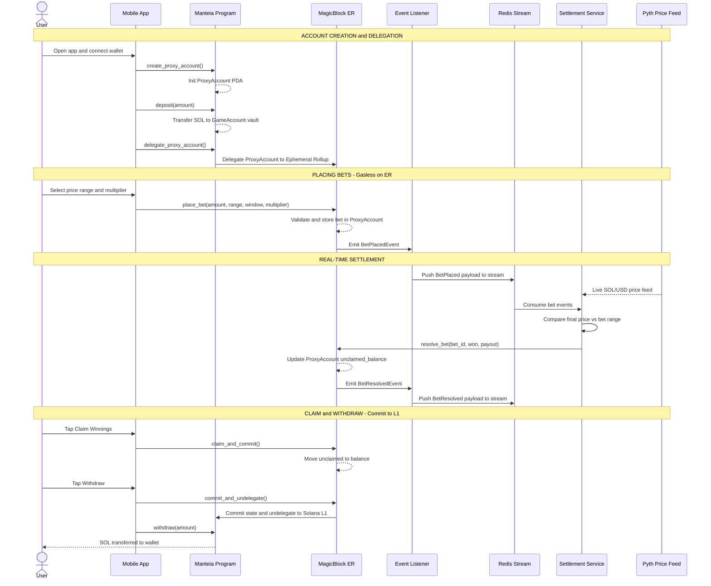

#   Manteia — Real-Time Solana Prediction Arena

[](https://solana.com)
[](https://magicblock.gg)
[](https://www.anchor-lang.com/)
[](https://expo.dev)
[](https://bun.sh)

> **Manteia** *(Greek for Divination)* — A hyper-fast, gamified prediction market on Solana where users bet on SOL/USD price ranges in ultra-short windows. Powered by **MagicBlock Ephemeral Rollups** for sub-millisecond, gasless execution with real-time settlement against live Pyth price feeds.

---

## ✨ Highlights

| Feature | Detail |
|---|---|
| **⚡ 10-Second Predictions** | Pick a SOL/USD price range, choose a multiplier, and watch it resolve in real-time |
| **�️ Sub-ms Finality** | State is delegated to MagicBlock Ephemeral Rollups — zero gas, instant confirmation |
| **📡 Live Settlement** | Settlement service consumes on-chain events + live Pyth prices to resolve bets automatically |
| **🔐 Solana-Secured** | Final state commits back to Solana L1 on withdraw — full base-layer security |
| **🎮 Gamified Arena** | Multiplayer battles, leaderboards, and a practice arena — feels like a game, not a DEX |
| **📱 Mobile-First** | React Native + Skia for buttery-smooth charts and one-handed trading on iOS & Android |

---

## 🏗️ Architecture Overview

Manteia uses a **delegate → execute → settle → commit** lifecycle powered by MagicBlock Ephemeral Rollups. The user's on-chain PDA (`ProxyAccount`) is delegated to an ephemeral rollup for gasless, high-speed interactions, and committed back to Solana's base layer on withdrawal.



---

## 🔄 Lifecycle: Bet → Settle → Withdraw

The complete user journey from account creation to SOL withdrawal:



---

## � Smart Contract Deep Dive

The Manteia Anchor program ([`HCvWBZpYDeiTMUaSmCRm5jP67M6wYV2NDBjAG4qdDLNE`](https://explorer.solana.com/address/HCvWBZpYDeiTMUaSmCRm5jP67M6wYV2NDBjAG4qdDLNE)) is optimized for high-volume, low-latency execution on MagicBlock Ephemeral Rollups.

### On-Chain State

| Account | Purpose | Key Fields |
|---|---|---|
| **`ProxyAccount`** | Per-user PDA holding balance and up to **10 active bets** | `owner`, `balance`, `unclaimed_balance`, `bets[10]`, `active_bet_count` |
| **`GameAccount`** | Global vault managing pooled SOL liquidity | `authority`, `total_deposits`, `bump` |
| **`Bet`** | Individual bet struct (74 bytes each) | `target_price_range_start/end`, `prediction_start/end_time`, `payout_multiplier`, `won`, `resolved` |

### Instruction Set

| Instruction | Description |
|---|---|
| `create_proxy_account` | Initialize a user's ProxyAccount PDA |
| `initialize_game_account` | Set up the global game vault |
| `delegate_proxy_account` | Delegate ProxyAccount to MagicBlock Ephemeral Rollup |
| `deposit` | Transfer SOL into the GameAccount vault and credit user balance |
| `place_bet` | Place a price prediction bet with range, time window, and multiplier |
| `resolve_bet` | Settle a bet as won/lost with calculated payout |
| `claim_and_commit` | Claim winnings and commit state to the rollup |
| `commit_and_undelegate` | Commit final state back to Solana L1 and undelegate |
| `withdraw` | Withdraw SOL from the vault back to user wallet |

### Emitted Events

- **`BetPlacedEvent`** — user, bet_id, amount, price range, time window, multiplier
- **`BetResolvedEvent`** — user, bet_id, won, bet_amount, payout_amount
- **`DepositEvent`** / **`WithdrawEvent`** — user, amount, new_balance

---

## 🛠️ Tech Stack

### On-Chain Infrastructure
| Technology | Role |
|---|---|
| **Solana** | Base layer for final state settlement and SOL custody |
| **Anchor** | Solana program framework for type-safe smart contracts |
| **MagicBlock Ephemeral Rollups** | Gasless, sub-ms transaction execution via state delegation |
| **Pyth Network** | Real-time SOL/USD oracle price feeds |

### Backend Services
| Technology | Role |
|---|---|
| **Bun** | High-performance runtime for WebSocket price server (`:3001`) |
| **Redis + ioredis** | Event streaming pipeline (`xadd` / `xreadgroup`) for bet lifecycle |
| **@solana/web3.js** | On-chain event listener for program log parsing |

### Mobile Frontend
| Technology | Role |
|---|---|
| **React Native / Expo** | Cross-platform mobile framework |
| **React Native Skia** | GPU-accelerated charts, animations, and visual effects |
| **Zustand** | Lightweight reactive state management |

---

## 📂 Project Structure

```
manteia/
├── manteia-contract/       # Solana Anchor program
│   └── programs/
│       └── manteia-contract/src/
│           ├── lib.rs                  # Program entrypoint & instruction routing
│           ├── state.rs                # ProxyAccount, GameAccount, Bet structs
│           ├── events.rs               # On-chain event definitions
│           ├── errors.rs               # Custom error codes
│           └── instructions/
│               ├── create_proxy_account.rs
│               ├── initialize_game_account.rs
│               ├── deposit.rs
│               ├── place_bet.rs
│               ├── resolve_bet.rs
│               ├── claim.rs
│               └── withdraw.rs
├── backend/                # Bun WebSocket server — broadcasts live SOL/USD prices
├── price-poller/           # Raw Pyth price feed parser & debugger
├── event-listener/         # On-chain event → Redis stream bridge
└── skia/                   # React Native Expo app with Skia rendering
    ├── app/                # Expo Router screens
    ├── components/         # Reusable UI components
    ├── state/              # Zustand stores
    ├── server/             # API client layer
    ├── utils/              # Helpers (Solana, formatting, etc.)
    └── types/              # TypeScript type definitions
```

---

## ⚙️ Getting Started

### Prerequisites

- [Anchor CLI](https://www.anchor-lang.com/docs/installation) (v0.30+)
- [Bun](https://bun.sh) (v1.0+)
- [Expo CLI](https://docs.expo.dev/get-started/installation/)
- Redis server running locally
- Solana CLI configured with a devnet/localnet wallet

### 1. Build the Smart Contract

```bash
cd manteia-contract
anchor build
anchor deploy          # Deploy to localnet or devnet
```

### 2. Start Backend Services

```bash
# Terminal 1 — Price broadcaster
cd backend
bun install && bun run index.ts

# Terminal 2 — Event listener
cd event-listener
bun install && bun run index.ts
```

### 3. Launch the Mobile App

```bash
cd skia
npm install
npx expo start
```

> **Tip**: Use Expo Go on your phone or an iOS/Android emulator to preview the app.

---

## 🎨 Design Philosophy

Manteia is built to feel like a **premium mobile game**, not a financial dashboard:

- **🎨 Visual Excellence** — Vibrant gradients, glassmorphism, and high-FPS Skia-rendered charts
- **⚡ Speed** — Interactions feel like gestures, not blockchain transactions
- **👆 One-Handed Flow** — All critical trading actions are within thumb-reach
- **🏆 Competitive Arena** — Real-time leaderboards & multiplayer prediction battles

---


